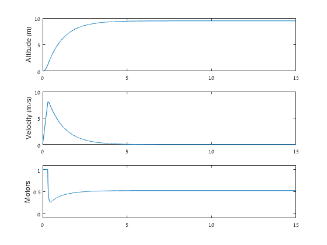

This folder contains a Matlab implementation of the quadcopter dynamics equations in
([Bouabdallah et al. 2004](https://infoscience.epfl.ch/record/97532/files/325.pdf)),
extended to work with general multi-copter (quad, hex, octo) configurations.  

## Quickstart

Launch Matlab, change your working directory to where you installed this repository, and do
```
  >> takeoff(10, .001);
```

This will run a simple [PID controller](https://en.wikipedia.org/wiki/PID_controller) to make a simulated 
quadcopter rise from the ground to 10 meters altitude, over a period of 40 seconds.
