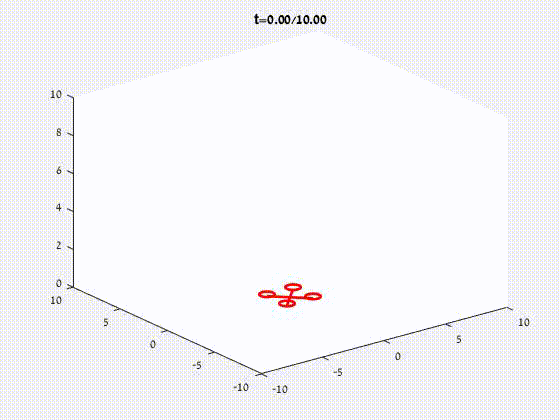

This folder contains implementations of the quadcopter dynamics equations in
([Bouabdallah et al. 2004](https://infoscience.epfl.ch/record/97532/files/325.pdf)),
extended to work with general multi-copter (quad, hex, octo) configurations.  

## Matlab instructions

Launch Matlab, change your working directory to <b>MultirotorDynamics/matlab</b>
, and do
```
  >> takeoff(10, .001);
```

This will run a simple [PID controller](https://en.wikipedia.org/wiki/PID_controller) to make a simulated 
quadcopter rise from the ground to 10 meters altitude, over a period of 10 seconds.

# Playback

The takeoff script returns an array of kinematic frames consisting of the current time and vehicle pose
(x, y, z, roll, pitch, yaw).  This array can be passed to a playback script to display a 3D movie:

```
  >> a = takeoff(10, .001);
  >> playback(a)
```

## Related projects

[gym-copter](https://github.com/simondlevy/gym-copter)

[MulticopterSim](https://github.com/simondlevy/MulticopterSim)

